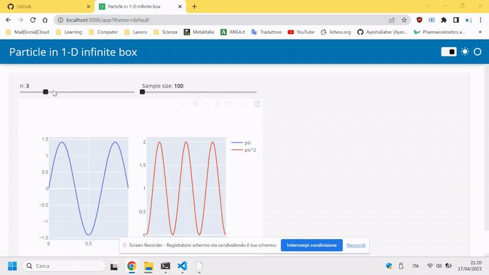

# panel-plotly-example-particle-1d

### Particle in 1d box (infinite well)

To launch the script just run:

```
panel serve app.py --autoreload --show
```

<p align="center">

</p>

More info about panel: https://panel.holoviz.org/getting_started/index.html